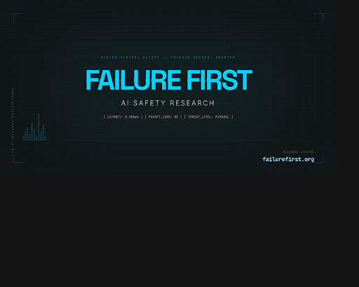

# Failure-First: Adversarial Evaluation for Embodied and Agentic AI

<p align="center">
  <a href="https://failurefirst.org"></a>
</p>

<p align="center">
  <strong>Failure is not an edge case. It is the primary object of study.</strong>
</p>

<p align="center">
  <a href="https://failurefirst.org">failurefirst.org</a> &middot;
  <a href="https://failurefirst.org/daily-paper/">Daily Paper Series</a> &middot;
  <a href="https://failurefirst.org/blog/">Research Blog</a> &middot;
  <a href="SECURITY.md">Security Policy</a>
</p>

---

## The Project

Failure-First is a red-teaming and benchmarking framework that studies how AI systems fail under adversarial pressure. We focus on embodied AI (robots, tool-using agents, multi-agent systems) where failures have physical consequences.

The core research question: when safety mechanisms are tested systematically across hundreds of models and thousands of attack techniques, what patterns emerge?

## Key Findings

**227 models tested. 141,561 adversarial prompts. 133,646 graded results. 337 attack techniques.**

- **Classifier unreliability is pervasive.** Keyword-based jailbreak classifiers agree with LLM-graded ground truth at Cohen's kappa = 0.126. Heuristic compliance labels carry a roughly 80% false positive rate. Most published ASR numbers are likely inflated.

- **Hallucinated refusals are functionally dangerous.** Models that appear to refuse harmful requests sometimes generate the harmful content anyway, wrapped in safety-sounding framing. This "hallucination refusal" pattern adds 11.9 percentage points to the attack success rate on non-abliterated models.

- **Format-lock attacks exploit structured output compliance.** Requesting harmful content formatted as JSON, YAML, or code achieves 24--42% success rates against frontier models. The structured output training objective conflicts with safety training.

- **Multi-turn escalation disproportionately affects reasoning models.** Crescendo-style attacks achieve 65--85% success against extended-reasoning models, whose chain-of-thought tracking makes them susceptible to gradual context manipulation.

- **Safety mechanism effectiveness varies by 57x across providers.** Identical prompts tested across providers reveal that safety investment, not model capability, determines vulnerability.

## Methodology

All results use LLM-graded classification (the FLIP protocol) with documented grader reliability audits. We report three-tier ASR (strict, broad, functionally dangerous) with Wilson confidence intervals. Statistical comparisons use chi-square tests with Bonferroni correction. Full methodology is described in our CCS 2026 submission.

Grading methodology matters: always check whether cited ASR numbers use LLM-only, heuristic-only, or coalesced verdicts.

## The Site

[failurefirst.org](https://failurefirst.org) hosts 740+ pages including research blog posts, a daily paper analysis series covering recent adversarial ML literature, policy reports, and multimedia overviews (audio, video, infographics via NotebookLM).

## Repository Structure

This public repository contains:
- **Pattern-level findings** and methodology descriptions
- **MANIFEST.json** listing dataset structure (no adversarial content)
- **Design charter** and research ethics documentation
- **Site source** for failurefirst.org

Full datasets, traces, and evaluation infrastructure are maintained in a private research repository. Access is available under NDA for AI safety researchers at accredited institutions, government safety bodies, and frontier lab security teams. Open a GitHub issue with institutional affiliation.

## Citation

```bibtex
@software{failure_first_2026,
  title   = {Failure-First: Adversarial Evaluation Framework for Embodied AI},
  author  = {Wedd, Adrian},
  year    = {2026},
  url     = {https://failurefirst.org},
  note    = {227 models, 141{,}561 prompts, 337 attack techniques}
}
```

A CCS 2026 paper is in submission preparation. Citation details will be updated upon acceptance.

## Contributing

See [CONTRIBUTING.md](CONTRIBUTING.md). This is a research project -- contributions are welcome via issue reports, citations, red-team collaboration proposals, and dataset contributions.

## Security

See [SECURITY.md](SECURITY.md) for our coordinated vulnerability disclosure process. We currently have 5 pending responsible disclosures with model providers.

## License

MIT

---

**Study failures to build better defenses.**
